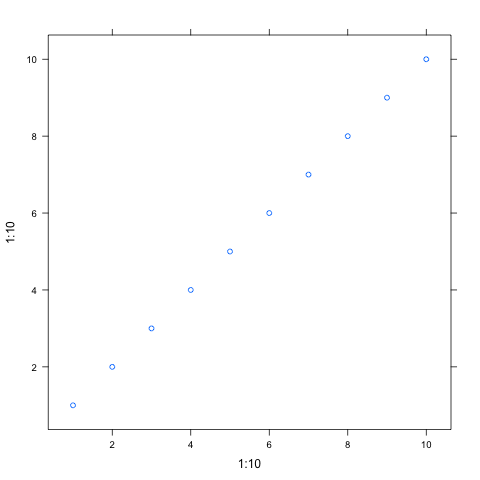

# Table of Contents

1.  [tricks](#orged0c5c5)
2.  [useful commands](#orgb8cf1bc)
3.  [useful arguments for code](#org5de62cc)
4.  [example: R](#org11e97ba)
    1.  [not contain a valid graphics format](#org7f3ae06)
    2.  [does produce a file, by printing object](#org18f8396)
    3.  [does produce a file, by using :results output](#org19b4f89)
    4.  [does produce a file, by evaluating in :session](#org234474f)
5.  [exmple (python): access code from different blocks](#org032190a)
6.  [example: latex](#org2bcd9b2)

# tricks

1.  to use inline image in mac, you need to have svg support. Try install emacs-plus
2.  show images as soon as run. (add-hook 'org-babel-after-execute-hook 'org-redisplay-inline-images)
3.  code indentation. (setq org-src-tab-acts-natively t)

# useful commands

export: C-c C-e

show inline image: C-c C-x C-v

show latex: C-c C-x C-l

run code: C-c C-c

# useful arguments for code

:results output

:session your session name

# example: R

## not contain a valid graphics format

    library(lattice)
    xyplot(1:10 ~ 1:10)

## does produce a file, by printing object

    library(lattice)
    print(xyplot(1:10 ~ 1:10))

## does produce a file, by using :results output

    library(lattice)
    xyplot(1:10 ~ 1:10)

## does produce a file, by evaluating in :session

    library(lattice)
    xyplot(1:10 ~ 1:10)

# exmple (python): access code from different blocks

    
    print(10)

    10

    print(a)

    10

    a = 5

    a + 10 ==100

# example: latex

\[
e^{i\pi} = -1
\]

\[
\int_0^\infty e^{-x^2} dx = \frac{\sqrt{\pi}}{2}
\]

