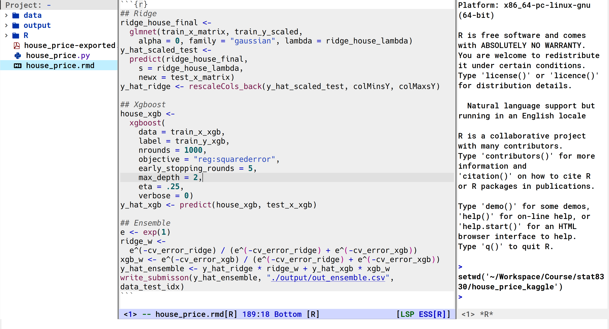

An emacs config tailored for statistician and data scientist.

# Table of Contents

1.  [Prerequisite](#orgfb4b193)
2.  [install](#orgf33587f)
3.  [Main Packages](#org64c0f2f)

# Prerequisite

-   emacs-29
-   Noto Sans Mono CJK SC: `yay -S noto-fonts`
-   hack: https://github.com/source-foundry/Hack/releases/download/v3.003/Hack-v3.003-ttf.zip
-   EB Garamond: https://fonts.google.com/download?family=EB%20Garamond

# install

-   clone this reposition to your home folder (~).
-   change folder name into .emacs.d. (adding a dot in the front)

# Main Packages

- vertico + marginalia + consult
- company-mode + company-posframe
- lsp-mode + lsp-ui
- ess + polymode + stan-mode
- python-mode + conda + code-cells
- auctex + reftex

