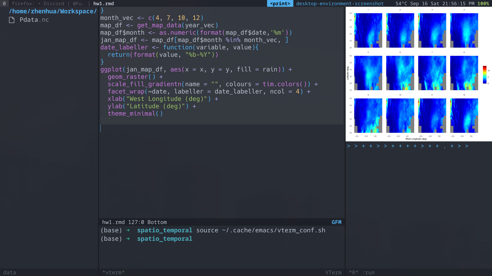

# Zhenhua Emacs Config

|  |  |
|:-------------------------------------:|:-----------------------------------:|
|          |        |

---

### Table of Contents

1.  [Prerequisite](#prerequisite)
2.  [Installation](#installation)
3.  [Main Packages](#main-packages)

# Prerequisite

-   emacs-29
-   Noto Sans Mono: https://fonts.google.com/download?family=Noto%20Sans%20Mono
-   Noto Sans Mono CJK SC: https://github.com/googlefonts/noto-cjk/raw/main/Sans/Variable/TTF/Mono/NotoSansMonoCJKsc-VF.ttf
-   Note Color Emoji: https://github.com/googlefonts/noto-emoji/raw/main/fonts/NotoColorEmoji.ttf
-   JetBrains Mono: https://download.jetbrains.com/fonts/JetBrainsMono-2.304.zip
-   EB Garamond: https://fonts.google.com/download?family=EB%20Garamond
-   Wallpaper: https://github.com/Gingeh/wallpapers

# Installation

-   clone this reposition to your home folder (~).
-   change folder name to `.emacs.d`. (adding a dot in the front)
-   run `(zw/install-fonts)` in emacs

# Main Packages

- vertico + marginalia + consult
- company-mode + company-posframe
- lsp-mode + lsp-ui
- ess + polymode + stan-mode
- python-mode + conda + code-cells
- auctex + reftex

