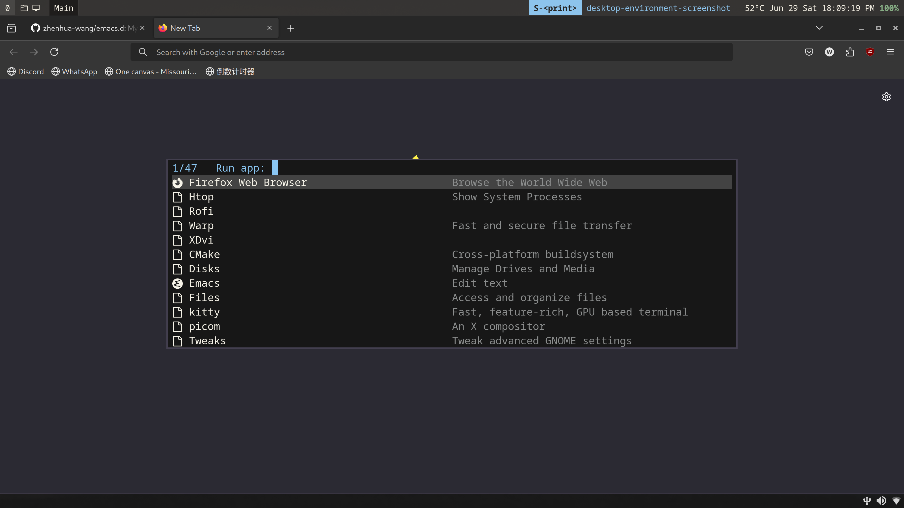

<div align="center">

# Zhenhua Emacs Config

|  |  |
|:-------------------------------------:|:-----------------------------------:|
|          |        |

</div>

---

### Table of Contents

1.  [Prerequisite](#prerequisite)
2.  [Installation](#installation)
3.  [Main Packages](#main-packages)
3.  [Debug Configuration](#debug-configuration)

# Prerequisite

-   emacs-29
-   (optional) Noto Sans Mono: https://fonts.google.com/download?family=Noto%20Sans%20Mono
-   (optional) Noto Sans Mono CJK SC: https://github.com/googlefonts/noto-cjk/raw/main/Sans/Variable/TTF/Mono/NotoSansMonoCJKsc-VF.ttf
-   (optional) Note Color Emoji: https://github.com/googlefonts/noto-emoji/raw/main/fonts/NotoColorEmoji.ttf
-   (optional) JetBrains Mono: https://download.jetbrains.com/fonts/JetBrainsMono-2.304.zip
-   (optional) EB Garamond: https://fonts.google.com/download?family=EB%20Garamond

# Installation

-   clone this reposition to your home folder (~).
-   change folder name to `.emacs.d`. (adding a dot in the front)

# Main Packages

- vertico + marginalia + consult
- company-mode + company-posframe
- eglot + dape
- ess + polymode
- python-mode + conda + code-cells
- auctex + reftex

# Debug Configuration

```elisp
emacs --init-directory .emacs.d/resources/test
```
